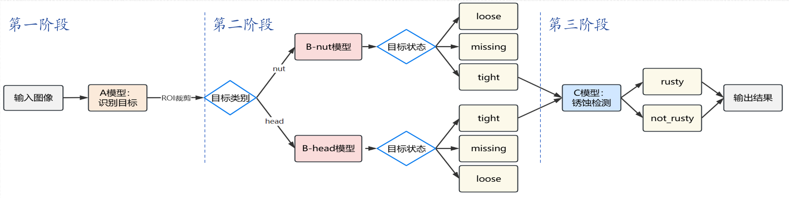

# 螺栓螺母缺陷检测平台

本项目是大创项目“基于目标检测的配电及牵引网带电作业智能化工具研发”的视觉检测与网页可视化部分，面向配电网、牵引网等高空带电作业场景，使用 K230 嵌入式平台实现螺栓/螺母目标检测、状态识别、锈蚀判断和浏览器端实时显示。

## 项目背景

配电网与牵引网带电作业需要满足严格的绝缘安全距离要求，作业人员通常依赖长距离绝缘工具完成远端操作。传统绝缘操作杆存在功能单一、视野受限、目标状态难以判断等问题，尤其在高空螺丝螺栓巡检与维护中，人工观察容易受距离、角度和背景干扰影响。

本项目将轻量化目标检测模型部署到 K230 边缘计算平台，并结合 HTTP/MJPEG 无线图传，使作业人员可以在浏览器端实时查看目标状态和缺陷统计，为“视、检、操”一体化的智能带电作业工具提供视觉感知能力。

项目目标是让绝缘操作杆不只具备远端操作能力，也能在作业前后提供实时观察和缺陷辅助判断，降低人工远距离观察的误判风险，提高带电检修的安全性和效率。

本人主要负责视觉检测模型设计、训练与嵌入式部署，以及视觉系统与网页端显示模块的联调实现。项目中基于 YOLOv8n 设计并实现了三阶段四模型级联推理架构，完成模型训练、转换和 K230 平台部署调试，并参与 HTTP/MJPEG 图传页面联调，实现浏览器端对设备检测结果的实时可视化显示。

## 功能概览

- 螺母、螺栓头目标定位
- 螺母/螺栓头状态识别：松动、缺失、正常
- 锈蚀状态识别：锈蚀、未锈蚀
- K230 端实时摄像头采集与 KPU 推理
- HTTP/MJPEG 实时视频推流
- 浏览器端控制摄像头、开启/关闭检测、调整置信度阈值
- 缺陷统计、当前帧统计和累计统计显示
- 检测记录自动保存、预览、下载和删除

## 技术路线

本项目没有采用单一模型直接完成全部缺陷判断，而是将复杂任务拆成“目标定位 -> 状态分类 -> 锈蚀分类”的三阶段四模型级联流程：

1. A 模型：检测图像中的 `nut` 和 `head`，获得螺母与螺栓头的位置。
2. B 模型：根据 A 模型识别出的部件类型，分别调用螺母状态分类模型和螺栓头状态分类模型，判断 `loose`、`missing`、`tight`。
3. C 模型：对判定为正常紧固的目标进一步进行锈蚀分类，判断 `rusty` 或 `not_rusty`。

这种级联方式将多状态识别问题拆解为多个更明确的子任务，减少类别混淆，更适合螺栓螺母目标小、状态差异细微、背景复杂的带电作业现场。

## 系统架构



图中展示了本项目的核心推理流程：第一阶段由 A 模型完成目标识别与 ROI 裁剪；第二阶段按照目标类别分别进入 B-nut 或 B-head 模型，判断目标状态；第三阶段将正常紧固目标送入 C 模型进行锈蚀检测，最终输出缺陷识别结果。

## 仓库结构

```text
bolt_detect/
├── data/
│   ├── main.py                 # 本地 LCD 检测入口
│   ├── main_http_loop.py       # HTTP 推流 + 四模型检测主入口
│   ├── bolt_detector.py        # 四模型级联推理核心逻辑
│   ├── detection_manager.py    # 检测记录保存、查询、删除
│   ├── rtsmart_web_adapter.py  # Python 与 RT-Smart Web 服务适配层
│   ├── wifi_config.py          # Wi-Fi 连接配置
│   ├── config.json             # 运行配置示例
│   └── static/
│       ├── index.html          # Web 控制台页面
│       └── app.js              # 前端状态轮询、控制与记录管理
├── sdcard/
│   ├── libs/                   # CanMV/K230 运行依赖库
│   ├── res/                    # 字体等资源
│   └── *.kmodel                # K230 KPU 模型文件
└── README.md
```

## 模型文件

代码默认加载以下 KModel 文件：

```text
/sdcard/2ndA_best.kmodel
/sdcard/B_nut_best.kmodel
/sdcard/B_head_best.kmodel
/sdcard/2ndC_rust_best.kmodel
```

`bolt_detector.py` 会依次从 `/sdcard/`、`/sdcard/2026.4/`、`/data/` 查找模型。部署前请确保模型文件名与代码中的默认名称一致；如果模型文件名不同，需要重命名或修改 `bolt_detector.py` 中的模型名称常量。

## 运行方式

### 1. 准备设备

- K230 / CanMV 开发板
- 摄像头模块
- 已编译包含 `rtsmart_web` 模块的 RT-Smart 固件
- 与电脑或手机处于同一局域网的 Wi-Fi

### 2. 部署文件

将仓库中的 `data/` 和 `sdcard/` 内容复制到 K230 对应文件系统中，并确认：

- `data/static/index.html` 和 `data/static/app.js` 可被 HTTP 服务访问
- 四个 `.kmodel` 文件位于 `/sdcard/` 或代码支持的模型路径下
- `wifi_config.py` 中的 `WIFI_SSID` 和 `WIFI_PASSWORD` 已修改为现场网络

### 3. 启动检测与推流

在 K230 / CanMV 环境中运行：

```python
python /data/main_http_loop.py
```

串口输出中会显示设备 IP，例如：

```text
请在浏览器访问: http://<device-ip>:8080/
```

在同一网络下使用手机或电脑浏览器打开该地址，即可进入实时检测页面。

如果只需要本地 LCD 显示，不需要浏览器推流，可以运行：

```python
python /data/main.py
```

## Web 控制台

浏览器端页面支持：

- 启动/停止摄像头
- 开启/关闭检测
- 调整置信度阈值
- 查看 FPS、处理帧数、检测总数
- 查看螺母、螺栓头、锈蚀分类统计
- 查看自动保存的检测记录
- 预览、下载、删除检测图片
- 日间/夜间主题切换

## 关键实现

- `data/bolt_detector.py`
  - 加载 A/B/C 四个 KModel
  - 执行 AI2D 预处理、目标检测、NMS、ROI 裁剪和分类推理
  - 将检测结果映射到显示坐标并绘制检测框

- `data/main_http_loop.py`
  - 负责 Wi-Fi 连接、HTTP 服务启动、摄像头采集、推理循环和状态保存
  - 将检测结果叠加到视频流
  - 对缺陷事件做短时间去重，维护累计缺陷统计

- `data/rtsmart_web_adapter.py`
  - 连接 MicroPython 代码与 C 层 HTTP/MJPEG 服务
  - 将图像压缩为 JPEG 后推送到浏览器端
  - 同步前端控制状态和运行统计

- `data/static/app.js`
  - 轮询设备状态
  - 更新实时视频、统计数据和检测记录
  - 处理前端按钮、置信度滑块和图片预览

## 当前状态

本仓库主要保存视觉检测与 Web 可视化相关代码，已实现 K230 端四模型级联推理、实时图传、检测结果显示和记录管理。硬件结构、绝缘操作头、传动机构等内容属于完整大创项目的实体装置部分，不完全包含在本仓库中。


